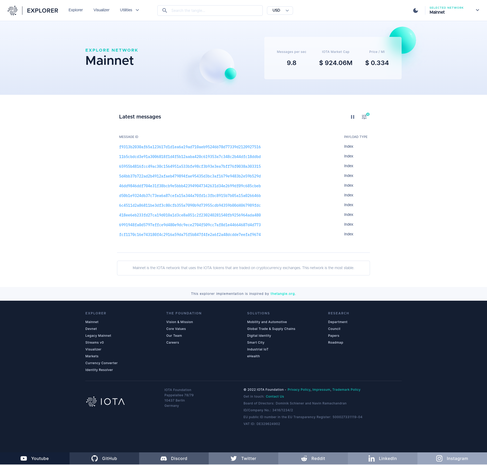

<h2 align="center">Explorer for the Tangle</h2>

<p align="center">
  <a href="https://discord.iota.org/" style="text-decoration:none;"></a>
    <a href="https://iota.stackexchange.com/" style="text-decoration:none;"></a>
    <a href="https://github.com/iotaledger/explorer/blob/main/LICENSE" style="text-decoration:none;"></a>
</p>

<p align="center">
  <a href="#about">About</a> ◈
  <a href="#prerequisites">Prerequisites</a> ◈
  <a href="#getting-started">Getting started</a> ◈
  <a href="#supporting-the-project">Supporting the project</a> ◈
  <a href="#joining-the-discussion">Joining the discussion</a>
</p>

---

## ⚠️ Deprecated Repository

**This repository is no longer maintained and has been deprecated in favor of [explorer (rebased)](https://github.com/iotaledger/iota/tree/develop/apps/explorer).**

Please refer to the new repository for the latest updates, bug fixes, and features.

## About

This repository is where the IOTA Foundation hosts the open-source code for the [Tangle Explorer website](https://explorer.iota.org/).



The code is composed of the following packages:

- [**`api`:**](api/README.md) Handles functionality such as lookups for the client
- [**`client`:**](client/README.md) Provides a user interface for the explorer, using React.

A demonstration of the API is available [here](https://explorer-api.iota.org).

This is beta software, so there may be performance and stability issues.
Please report any issues in our [issue tracker](https://github.com/iotaledger/explorer/issues/new).

## Prerequisites

To deploy your own version of the Tangle Explorer website, you need to have at least [version 14 of Node.js](https://nodejs.org/en/download/) and at most v16.16 installed on your device.

To check if you have Node.js installed, run the following command:

```bash
node -v
```

If Node.js is installed, you should see the version that's installed.

## Getting started

1. `npm i`
2. Install all dependencies `npm run setup:dev`
3. See the [deployment instructions](api/DEPLOYMENT.md).

## Supporting the project

If the Tangle Explorer website has been useful to you and you feel like contributing, consider submitting a [bug report](https://github.com/iotaledger/explorer/issues/new), [feature request](https://github.com/iotaledger/explorer/issues/new) or a [pull request](https://github.com/iotaledger/explorer/pulls/).

See our [contributing guidelines](.github/CONTRIBUTING.md) for more information.

## Joining the discussion

If you want to get involved in the community, need help with getting set up, have any issues or just want to discuss IOTA, feel free to join our [Discord](https://discord.iota.org/).
